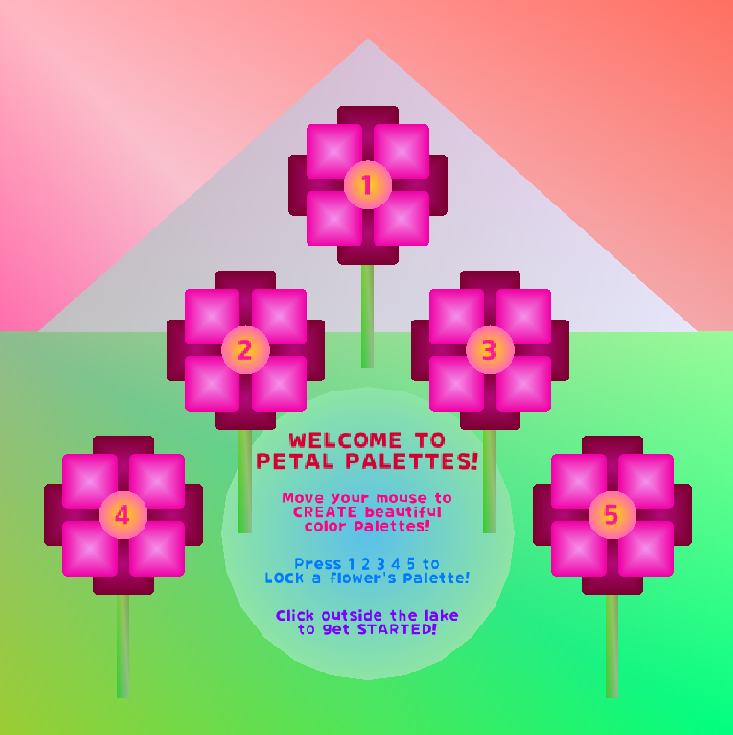

# PETAL PALETTES

Welcome to **Petal Palettes**! An interactive experience, made with GameMaker Studio 2, where you can explore and create beautiful color palettes inspired by the beauty of nature.

## Demo

Check out this YouTube [demo](https://youtu.be/4BTWvUylnRo) video to see **Petal Palettes** in action!

## Instructions

- Welcome to **PETAL PALETTES**!
- Move your mouse to **CREATE** beautiful color palettes!
- Press `1`, `2`, `3`, `4`, or `5` to **LOCK** a flower's palette.
- Click outside the lake to get **STARTED**!

After locking a flower, **CLICK** on it to see its color details (RGB values and hex codes)!

## Instructions for Local Use

### Option A: Run on GameMaker Studio 2

#### Prerequisites

- Install [Steam](https://store.steampowered.com/about/download) and create an active Steam account.
- Install GameMaker Studio 2 on your machine via Steam.
- Ensure all necessary dependencies are properly installed and configured within GameMaker Studio 2.

#### Steps to Run Petal Palettes Locally

1. Clone this repository to your desired directory.
2. Open Gamemaker Studio 2.
3. Select "Open Project" and navigate to the directory where the cloned repository is located.
4. Open the `PetalPalettes.yyp` project file.
5. Run the project by clicking the play button within GameMaker Studio 2.
6. Explore and enjoy!

### Option B: Run the Windows Build

1. Download the `PetalPalettesWindows.zip` file.
2. Extract the downloaded `.zip` file.
3. Open the extracted folder and run the `PetalPalettes.exe` application.
4. Explore and enjoy!

## About

In **Petal Palettes**, you’ll find a vibrant landscape filled with flowers. As you move your mouse, one flower will randomly change the colors of its petals, while the other flowers will adapt their colors based on your mouse position relative to the background. This interaction encourages exploration and creativity in discovering various color combinations.

I created this project to provide users with a fun way to explore color palettes and to help them utilize these colors effectively by displaying the corresponding RGB values and hex codes when they click on a flower.

This project has been designed to be responsive, allowing users to edit the room size without compromising functionality. Whether you choose a larger or smaller canvas, the interactive elements will adjust seamlessly to fit the new dimensions.

Enjoy your journey through color and let your creativity bloom!

## Credits

- `fnt_oshigo`: _推しゴ_ designed by アトリエこたつ. Available at [this](https://booth.pm/ja/items/5635169) link.

## Usage

While I appreciate interest in my project, please note the following:

- **Attribution**: If you do use any assets or code from this project that are credited to others, please ensure you follow the respective licenses and provide proper attribution.

- **Commercial Use**: This project and its original assets cannot be used for commercial purposes without my written consent.

## Contact

I’d love to hear from you! If you have any questions, feedback, or suggestions about **Petal Palettes**, feel free to reach out.

    Email: feliiizabeth@gmail.com

Thank you for exploring **Petal Palettes**!
